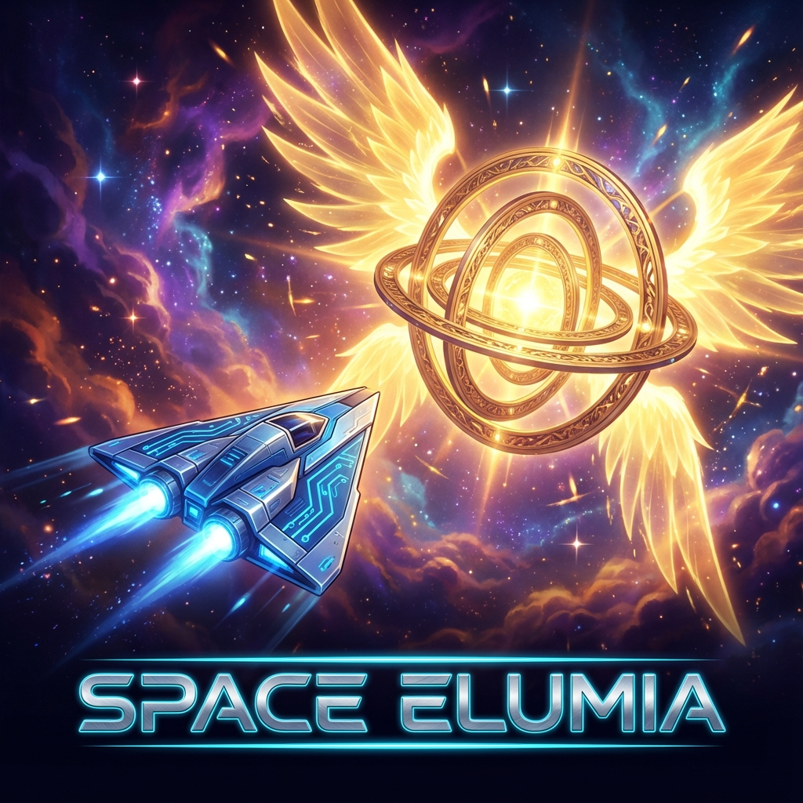

# Space Elumia 🚀 https://ritikiitg.github.io/gamejam/

**Space Elumia** is a high-octane, vertically scrolling arcade space shooter that brings the classic "bullet hell" experience directly to your browser. No downloads, no installations, just pure action.

> **"All Systems Secured. Galaxy Safe."**

## ✨ Features

- **Zero Installation**: Runs entirely in a single HTML file. Just download and play!
- **Epic Boss Battles**: Face off against 5 distinct boss phases: _The Watcher_, _The Kraken_, _The Hive_, _The Devourer_, and _The Seraphim_.
- **Hard Mode**: Test your skills with the new difficulty toggle (4x Boss HP).
- **Dynamic Weapon System**: Upgrade your arsenal with Spread Shots, Lasers, Wave Cannons, and Plasma Bolts.
- **High-End Visuals**: Experience 60FPS action with smooth particle effects, screen shake, and "shine" impact visuals.
- **Local Leaderboard**: Compete against yourself with a persistent high-score system.
- **Immersive Audio**: Custom-synthesized sound effects powered by the Web Audio API.

## 🎮 How to Play (No Install Needed!)

1.  **Download**: Simply save the `index.htm` file to your computer.
2.  **Open**: Double-click the file to open it in your favorite web browser (Chrome, Edge, Firefox, Safari).
3.  **Engage**: Click "INITIALIZE MISSION" and blast off!

That's it! The game runs completely offline.

## 🕹️ Controls

| **Move** | `W` `A` `S` `D` / Arrows | Pilot your ship |
| **Shoot** | `Space` | Fire main weapons |
| **Dash** | `Shift` | High-speed dodge (Invincible) |
| **Auto-Fire** | `E` | Toggle automatic shooting |
| **Full Screen** | `F` | Toggle Full Screen Mode |
| **Mute Audio** | `M` | Toggle Sound Effects/Music |
| **Pause** | `P` | Pause the mission |

### 📱 Mobile / Touch Controls

- **Move**: Touch and drag anywhere on the screen. The ship will follow your finger smoothly.
- **Shoot**: Auto-fire is enabled by default. Use the **AUTO** button in the HUD to toggle.

## 🏆 Scoring

- **Fighter**: 100 pts
- **Drone**: 150 pts
- **Interceptor**: 250 pts
- **Stealth**: 300 pts
- **Tank**: 400 pts
- **Turret**: 500 pts
- **Bomber**: 600 pts
- **Bosses**: 5000 x Level pts

Good luck, Pilot. The galaxy is counting on you.

---

_Built with ❤️ by Ritik Raj using HTML & React._
